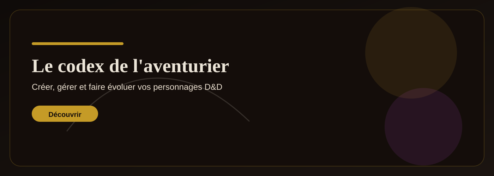
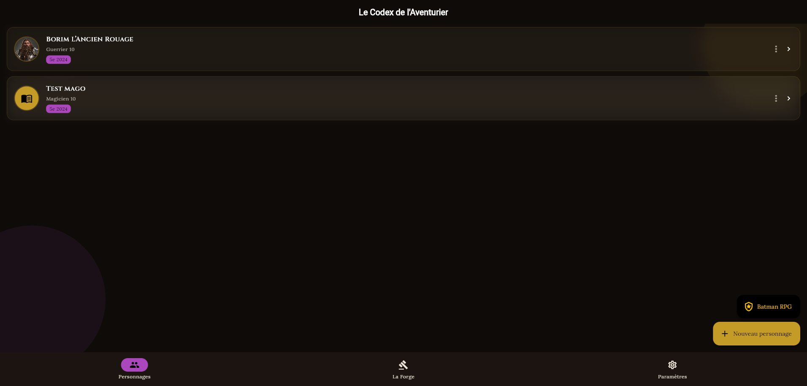
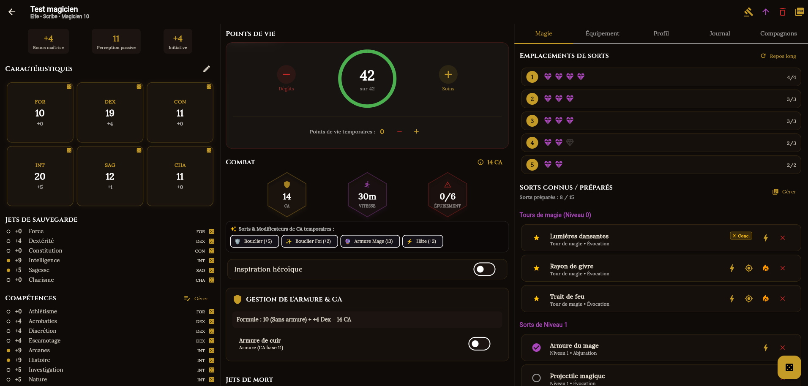
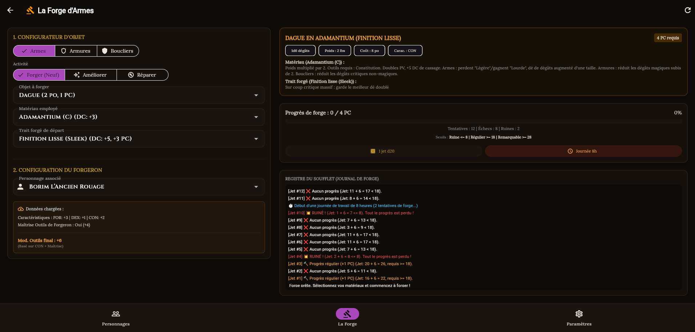

# Le Codex de l'Aventurier 🎲✨

[](LICENSE)
[](https://flutter.dev)
[](https://dart.dev)
[](https://github.com/Rahdidibu/dndCarac/releases)



**Le Codex de l'Aventurier** est une application moderne et réactive développée avec Flutter pour créer, gérer et faire évoluer vos personnages D&D 5e (Règles 2014 & 2024). L'application prend en charge la création guidée, les fiches interactives, le calcul dynamique de Classe d'Armure (CA), le lancer de combat en 1-clic, la bourse de monnaie automatique et la gestion des familiers/invocations.

---

## 🌟 Fonctionnalités Principales

- 🧙‍♂️ **Assistant de Création de Personnage Guidé** : Choix des règles (2014 / 2024), de la race, de la classe, de l'historique et répartition des caractéristiques.
- ⚔️ **Attaques Rapides & Lancer de Dégâts 1-Clic** : Jet de d20 (avec Avantage/Désavantage/Normal) + dégâts combinés avec détection des coups critiques (dés doublés) et échecs critiques.
- 🎯 **Traits d'Armes & Modificateurs de Jet** :
  - **Plage de critique élargie (19-20)** automatique ou manuelle.
  - **Relance automatique des 1 et 2 aux dégâts** (*Great Weapon Fighting* / Armes à deux mains).
  - **Armes Vicieuses** (+7 dégâts fixes en critique).
- 🛡️ **Calculateur Dynamique de Classe d'Armure (CA)** :
  - Ajustement automatique selon l'armure équipée, le bouclier et les bonus de Dextérité.
  - Modificateurs de sorts en 1-clic (🛡️ *Bouclier +5*, ✨ *Bouclier de la Foi +2*, 🔮 *Armure de Mage 13*, ⚡ *Hâte +2*).
  - Modal expliquant le détail complet du calcul de la CA.
- 💰 **Gestionnaire de Bourse de Monnaie** :
  - Saisie rapide, conversions automatiques de pièces (PO, PP, PA, PC), optimisation de la bourse et bouton de vidage sécurisé.
- 🐾 **Fiches de Familiers & Invocations** :
  - Ajout rapide de compagnons (Imp, Serviteur Invisible, Élémentaire de Feu, Loup, etc.) avec PV, CA et attaques intégrées.
- 🦇 **Univers Thématisés & La Forge** : Contenu spécial et assistant Batman/Forge.
- 🌐 **Multilingue (Français & Anglais)** & Mode Sombre Cyber-Fantasy.
- ☁️ **Authentification & Synchronisation Optionnelles** via Supabase.

---

## 📸 Aperçu





---

## 🛠️ Stack Technique

- **Framework** : [Flutter](https://flutter.dev) (Web & Android)
- **Langage** : [Dart](https://dart.dev)
- **Gestion d'État** : Riverpod 2.x
- **Base de Données Locale** : Drift (SQLite avec support IndexedDB pour le Web)
- **Backend Optionnel** : Supabase (Authentification & Synchro Cloud)
- **Conteneurisation** : Docker & Nginx

---

## 🚀 Préréquis & Installation Local

### Préréquis
- Flutter SDK `3.8.0` ou supérieur
- Dart SDK
- Google Chrome ou un émulateur Android

### Installation

1. **Cloner le dépôt** :
   ```bash
   git clone https://github.com/Rahdidibu/dndCarac.git
   cd dndCarac
   ```

2. **Installer les dépendances** :
   ```bash
   flutter pub get
   ```

3. **Générer les fichiers de traduction** :
   ```bash
   flutter gen-l10n
   ```

4. **Lancer en local (Web)** :
   ```bash
   flutter run -d chrome
   ```

---

## 🐳 Déploiement Production (Docker & Raspberry Pi)

Le projet inclut des scripts de build automatisés dans le dossier `deploy/` :

1. **Compiler le Web & l'APK localement** :
   ```bash
   ./deploy/build_all.sh
   ```
2. **Déployer sur votre serveur / Raspberry Pi** :
   ```bash
   ./deploy/deploy.sh
   ```

Les conteneurs Docker utilisent Nginx optimisé avec compression Gzip, SSL et gestion de cache.

---

## 📄 Licence

Ce projet est sous licence **MIT**. Voir le fichier [LICENSE](LICENSE) pour plus de détails.
